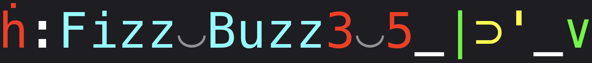

# fb1337 Quick Start Guide

fb1337 is an experimental highly expressive, stack- and array- based code golfing language written in Python.

Its goal is to explore the limits of expressive and concise translation of algorithms into runnable code.

## Quick Overview

Programs in fb1337 typically consist of extremely short strings of unicode characters.

For example, FizzBuzz is only 20 characters in fb1337:


```fb1337
ḣ:Fizz‿Buzz3‿5_|⊃'_∨
```

While APL was an inspiration and many of the glyphs are shared with APL, the syntax is very different. The biggest difference being that fb1337 is a stack-based language. Similar languages are the code golf language, GolfScript, and the stack- and array- hybrid language, Uiua.

For more on the language see [Language Overview](./docs/language_overview.md).

For more on how the internals work see [Parser Description](./docs/code_and_parameter_parsing.md) and [Interpreter Internals](./docs/interpreter_internals.md). 

## Installing and Using fb1337

Download all the code in the project to a new folder on your computer and name it fb1337.

#### Option 1. Run from the command line

In your terminal, navigate to the `fb1337/cli` folder. To run a simple program as a string, type:

```bash
./fb1337 -c 'Hello` World`!'
```

To run a simple program in interactive mode, type:

```bash
./fb1337 -i -c '1 2 +'
```

To run a file containing fb1337 code in annotation mode, type:

```bash
./fb1337 -d ../examples/fizzbuzz
```

To get help:

```bash
./fb1337 -h
```

It is highly recommended to run the Command Assistant in another terminal window while entering code on the command line. To run it from your terminal, navigate to the `fb1337/tools` directory and type:

```bash
python command_assistant.py
```

#### Option 2. Run as a Python Module without Installing

In Python, copy the following template to get started, entering the correct path to your downloaded copy of the `fb1337` package. 

```python
import sys
sys.path.append('[path]/fb1337')
from fb1337 import run, run_annotated, run_interactive

if __name__ == '__main__':
    print(run('Hello` World`!'))
    run_annotated('1 2 3++')
    run_interactive('hello` to` all` good` people ` ⤲↑3 /µ` «⊕⊕)`!⊕')
```

#### Option 3. Install as a Python Package with Pip

You can install the package locally on your computer with pip. Navigate to the main `fb1337` directory which contains setup.py and type

```bash
pip install -e .
```

Now you can use it like any other Python package.

```python
from fb1337 import run, run_annotated, run_interactive

if __name__ == '__main__':
    print(run('Hello` World`!'))
    run_annotated('1 2 3++')
    run_interactive('hello` to` all` good` people ` ⤲↑3 /µ` «⊕⊕)`!⊕')
```

If you want to remove fb1337 at a later date, type anywhere in the command line:

```bash
pip uninstall fb1337
```

## Documentation Index

- [Language Overview](./docs/language_overview.md) provides an overview of how to program in fb1337. This is the best place to start if you want to try programming in the language

- [Input Parsing](./docs/code_and_parameter_parsing.md) and [Interpreter Internals](./docs/interpreter_internals.md) provide a lot more details on the language and how expressions are parsed and evaluated. If you are confused about how to enter data, or how expressions are being evaluated, or simply want to know more about how fb1337 was created, these documents are a useful place to start. If you want to read the source code, the main file to look at is [execute.py](./fb1337/execute.py) and work from there.

- [Simple Programs](./docs/simple_programs.md) is an ongoing list of some simple code challenges and the shortest or most interesting solutions in fb1337 so far.

- [Background](./docs/project_background.md) is a document about the reason for creating this project as well as some background information on APL, array languages, functional programming and code golfing.

- [Project Reflections](./docs/project_reflections.md) is an essay about my learnings from this project. In particular, whether there are significant opportunities for greater brevity and expressivity that 'off the path' languages such as APL, Lisp, Haskell and Forth can teach us. 

- [Combinatory Logic](./docs/combinatory_logic.md) is a quick guide to functional combinators if you were wondering about their use in fb1337. The code_report YouTube channel has lots of information on APL and combinators, in particular I would recommend the talk by Conor Hoekstra [Function Composition in Programming Languages]([Function Composition in Programming Languages - Conor Hoekstra - CppNorth 2023 - YouTube](https://www.youtube.com/watch?v=JELcdZLre3s))

- [Code Golf](./docs/code_golf.md) is an introduction to the weird and wacky world of code golfing.
