```mermaid
flowchart LR
    num_list-->self["𝒲"]
    self-->group["group ⊆"]
    self-->group
    group-->map_rows["map rows ⋯"]
    map_rows-->psi["𝚽"]
    psi-->select["0 select ⊇"]
    psi-->count["count #"]
    select-->pair["pair ‿"]
    count-->pair
    map_rows-->count_list
```

# Project Reflections

## How successful was fb1337?

Recalling the goals I set out in [Project Background](project_background.md):

1. Express FizzBuzz a tersely and clearly as possible

2. Code a wide variety of code challenge problems in the language to demonstrate the universal applicability of the language in this problem domain

3. To write a personal code golfing language to use for my own enjoyment!

### 1. FizzBuzz in fb1337

Recall that I had in mind an 'optimal' FizzBuzz to build the language around.

```
1..100:3|?Fizz+5|?Buzz∨
```

I did manage to create a 20 character FizzBuzz, which is an impressive achievement:

```fb1337
ḣ:Fizz‿Buzz3‿5_|⊃'_∨
```

For comarison the Jelly code golfing language also manages 20 characters (and I couldn't find any other code golf language that was shorter), but at the cost of being almost completely incomprehensible[^1].
[^1]: Here's what's going on in the Jelly FizzBuzz `³µ3,5ḍTị“¡Ṭ4“Ụp»ȯµ€G`: (1) `³` is a shortcut for value 100. (2) `€` takes a number (100) and a function (inside a pair of 'µ' charaters) and applies the function to each of the values from 1 to 100. (3)` µ...µ` creates an anonymous function that takes a single value. (4)`3,5ḍ" 'ḍ` tests for divisibility, in this case it is given the sequence [3 5] and so produces a pair containing [1], [2], or [1, 2] depending on which of the divisibility tests succeeds. (5) `“¡Ṭ4“Ụp»` is a dictionary index lookup for the two strings "Fizz" and "Buzz" which have been compressed using Jelly's base 250 lookup code (¡Ṭ4 = 108803 = 2589 w/ flags for case-switched and short dictionary; Ụp = 46613 = 6044 w/ case-switched short dictionary). (6) `Tị` retrieves the strings at the given index(es) and joins them together. (7) `ȯ` is an 'or' which implicitly replaces an empty string with the function variable. (8)`G` joins the resulting values with a line-feed character between them for output.

```jelly
³µ3,5ḍTị“¡Ṭ4“Ụp»ȯµ€G
```

But going back to my 20-character fb1337 solution,

```fb1337
ḣ:Fizz‿Buzz3‿5_|⊃'_∨
```

 while it is far superior to the Jelly version in readability, I can't say I'm entirely happy with it.

1. I don't think it is as readable as it should be, even if you know that the `ḣ`,  `⊃` and `'` symbols mean '100', 'boolean select' and 'string' respectively. A big part of that is the post-fix order that is imposed by being a stack language combined with the glyph notation, which leads to an ugly bunching of 'verbs' at the end, somewhat like a convoluted German sentence[^2].
   [^2]: Compare for example with the structure of 'Um noch rechtzeitig am Bahnhof anzukommen, sie **hätte gehend essen müssen**', which means 'In order to arrive at the station in time, she would have had to eat while walking'.

2. It doesn't follow the same algorithm. To be more terse, it calculates the divisibility by 3 and 5 at the same time and then selects from the list ['Fizz' 'Buzz'] depending on the result (much like the Jelly code, incidentally). Instead of joining the strings, it 'stringifies' the list which converts each item into a string and joins them together, which is not what you might expect to happen.

3. We didn't manage to get rid of the implicit variable, in fact `_` appears twice in the expression. While fb1337 has combinators (see below) that could eliminate this repetition, it would take more characters.

A more satisfying version is 25 characters:

```fb1337
100:3_|?FizzØ5_|?BuzzØ⊕_∨
```

This sticks pretty close to the original conception, apart from the post-fix ordering of operations. I think this version is every bit as clear and readable as I had hoped for. 

Again the implicit variable appears, now 3 times, and again the combinator solution that eliminates them is longer and less clear. 

One solution for this would be to use implicit partial application. But I found this almost impossible to make work across a whole language while being sufficiently clear what you want to happen. It can be made clearer notationally, for example using parentheses, but this adds even more characters. Alternatively, functions could all be single valued (binary functions would return another function) as in Haskell, but this causes other problems. In the end, I found it best to keep the implicit variable signifier.

There is also two references to null `Ø`, which could be eliminated if we added a separate version of the 'if' `?` operator that returned null automatically when false, as I had originally conceived, but I found relatively few other use-cases, so decided not to add it. 

Overall, we lost 5 characters compared to the original template, that don't add much information.

On the positive side, we gained 3 characters at the start of the expression. It quickly became clear that the 'iterate' primitive, `:` could make a sensible choice given practically any type of object to iterate over, even an integer, without any confusion or ambiguity. I don't think it is too unexpected that `100:` should mean 'iterate over the values 1 to 100'.

### 2. How well did fb1337 handle the code challenges?

Actually really well. 

Certainly I found myself altering the language as I went through the challenge problems. The harder problems quickly helped me identify when I was missing some important functionality, or an operator was producing the wrong kind of output, or a data abstraction wasn't working properly.

The main observation was that APL is really well designed and I frequently found myself gravitating to APL's way of doing things in many cases. So much so, that I switched out most of the glyphs to match the equivalent APL version and altered the functionality to get closer to APL's.

Another observation is that sometimes you can't avoid iteration without a lot of effort. In many cases the simplest and shortest solution was to use the stack operators with iteration. Sometimes combinators were neater, but rarely shorter. Array-only solutions were satisfying when I could use them, but again rarely shorter.

One critical feature that I think a lot of stack languages lack is the ability to create what I called 'pinned variables'. Frequently, a function or block would need to act on several values at once and ensure that they were present in the right order at the start and end of the function. The result was quite a lot of stack manipulation and some real difficulty keeping track of what exactly was where. A good example was in one of the LeetCode challenges that identifies the smallest number of swaps to put two lists into strictly increasing order [(Leet Code 801)](https://leetcode.com/problems/minimum-swaps-to-make-sequences-increasing/description/). On each iteration, the stack contains 4 separate objects:

```
[3 5 4] # The remaining elements of the first array
[3 4 7] # The remaining elements of the second array
2       # The fewest swaps so far if the previous value was unswapped
3       # The fewest swaps so far if the previous value was swapped
```

All four of these are required in each of two calculations to complete the iteration. Rather than fill the code with a good deal of stack 'dup'`∂` and 'swap'`«` commands, I decided to create a new operator 'pin'`⇶` that would add all of them to the local namespace.

In the end, fb1337 feels a little bloated because it has operators for stack manipulation *and* pinned variables; for higher-level array functions *and* iteration; and for combinators *and* implicit variables. In addition, I ended up with 4 different array types (compared to only 2 in APL and 1 in GolfScript).

### 3. Is fb1337 a language I would use for personal enjoyment?

I did enjoy completing the coding challenges in fb1337. Sometimes the solutions are simply delightful, particularly those you would never possible think of in C++. One of my favourites is from [LeetCode 14](https://leetcode.com/problems/longest-common-prefix/description/), which asks you to find the longest common prefix of a list of strings. I found the following solution using combinators:

```fb1337
/𝒮⊃𝚿∘=∖∧ⁿ
```

While the solution might seem a bit convoluted, I think it is really elegant, which especially clear when you see the solution in diagramatic form.

```mermaid
flowchart LR
    next_string-->S["𝒮"]
    prefix_so_far-->Psi["𝚿"]
    S-->Psi
    S-->select
    Psi-->n["digits ⁿ"]
    n-->equal["equal ="]
    equal-->scan_and["scan with 'and' ∖∧"]
    scan_and-->select["select ⊃"]
    select-->new_prefix
```



It was fun comparing my solutions to Conor Hoesktra's code_report solutions for the same problems in APL or BQN. My solutions were often quite similar, but significantly shorter.

And I found the language made me think hard about the ways I could best make use of fb1337's capabilities, often leading to new ways to solve the problems.

I definitely want to keep using fb1337 and continue to refine it as I think there are several improvements I want to make. In particular, I would like to make it slightly smaller by eliminating some of the array types and duplicated functionality. I also would like to have a version running on my phone so I can write short programs on-the-go. And I would also like to create a nice interactive programming environment, rather like [BQN Pad](https://bqnpad.mechanize.systems).

## A Random Collection of Things I Learned About Programming from the Project

### Functional programming is more declarative

In general, I think it is useful to eliminate unnecessary code, particularly the need for variables, names and syntactic sugar; and to work in terms of whole-containers rather than individual elements.

For the most part I think that being more declarative is a win, it expresses the intent of the algorithm more clearly with less code and less accidental complexity. In general, it is harder to make small errors. 

C is notoriously buggy language, and a lot of that has to do with the microscopic concerns involved in looping through memory structures.

To take a simple example, let's look at the first iteration of a C program that takes a pointer to a string and determines whether or not it is a palindrome.

```c
int is_palindrome_with_errors (const char* str) {
    const char* i, j;
    for (j = str + strlen(str); j > 0; j--, i++) {
        if (*i != *j) return 0;
    }
    return 1;
}
```

The code has 6 different bugs in it - see if you can spot them all.

By contrast, in Haskell it is quite hard to mess this up.

```haskell
palindrome :: String -> Bool 
palindrome str = str == reverse str
```

### Less Code is (Often) Better

For example, take the following C function that counts up how many times each value appears in an array:

```c
int array_count(const int* array) {
    int count[100] = {0};
    for (const int* current = array; *current > 0; current++) {
        if (*current >= 0 && *current < 100) count[*current]++;
    }
    for (int i = 0; i < 100; i++) {
        printf("%d:%d\n", i, count[i]);
    }
    return 0;
}
```

Notice how many variables we need for this. 

- The incoming array `array` has a name, even though its only use is to initialise the iteration pointer

- The count array also needs a name, although it is used only to accumulate the values and print them out

- The iteration pointer `current` needs a name even though its only purpose is to loop through the number list

- The iteration index `i` needs a name, even though its only purpose is to loop through the output list.

###### Combinators and Pipelines

We can write the same program completely implicitly in fb1337 using combinators.

```fb1337
𝒲⊆ ⋯𝚽 ‿⊢ # ⟜0⊇
```



Sometimes, the need to name things becomed absurd, as in the following, only slightly exaggerated, Python example:

```python
num_list = [1, 3, 5, 7, 6, 4, 3]
sorted_list = sorted(num_list)
odds_removed = [x for x in sorted if x % 2 == 0]
odd_digit_string = ''.join([str(x) for x in odds_removed])
integer_value = int(odd_digit_string)
print(integer_value)
```

What we would like to do is simply pipe the functions one to another as in Elixir (although it is a shame we have to specify all of the module names).

```elixir
num_list 
    |> Enum.sort()
    |> Enum.filter(fn(x) -> (rem x, 2) == 0 end)
    |> Enum.map(fn(x) -> Integer.to_string(x) end)
    |> Enum.join()
    |> String.to_integer()
    |> IO.puts()
```

We get an additional benefit with pipelines, in that it is possible to run each part of the pipeline concurrently. Whether or not a compiler or interpreter chooses to do so, is no longer the programmer's concern. For example we can make use of Unix pipelines to create a simple concurrent version of FizzBuzz[^3].
[^3]: In practice unix pipes tend to buffer around 4k of data at a time, so for only 100 values, it is probably executing sequentially.

```bash
seq 100
| awk '{if ($1 % 3 == 0) print $1, $2 "Fizz"; else print}'
| awk '{if ($1 % 5 == 0) print $1, $2 "Buzz"; else print}'
| awk '{if ($2 == "") print $1; else print $2}'
```

###### Use the Stack

Stack languages can use the stack for the same purpose - if every function takes values from the stack and returns them to the stack, we can simply line up the functions.

```fb1337
↗}⊸2|'ℤ
```



```mermaid
flowchart LR
    num_list-->sort["sort ↗"]
    sort-->filter_even["filter } even 2|"]
    filter_even-->stringify["string '"]

    stringify-->to_int["integer ℤ"]
    to_int-->value
```

###### Partial Application

Notice a difference between the fb1337 and Elixir solutions: whereas Elixir requires its anonymous functions to use a variable, we can use partial application in fb1337 using the `⊸`'bind' operator. 

In Haskell, partial application is taken to the extreme as **all** functions are effectively single valued. For example `add` in Haskell has the type signature:

```haskell
add :: Int -> Int -> Int
```

which means that it takes an integer and returns a **function** from integers to integers. Thus `add 3` creates a function that will add 3 to another value. When we write:

```haskell
add 3 5
```

this really means `(add 3) 5`. 

Partial application of functions means that we can chain functions more easily, but it also allows us to pass implicit values into multi-valued functions as in Elixir.

###### APL Syntax

The final approach to implicit values is that seen in the APL languages. On the one hand some combinators are part of the syntax: 

```apl
+/÷≢
```

This calculates the average of a list, is applying a fork (phi combinator) because it consists of three operators in a row. Additionally, values are passed from one function to the next as in:

```apl
÷+/
```

This gives the reciprocal of the sum of a list - the list is passed to `+/` and the resulting value is passed to `÷`. 

In addition, it is possible to refer to the left and right arguments of a function explicitly using `⍺` and `⍵` respectively. Alternatively, we can also use the operators `⊣` and `⊢` to do the same thing functionally. While it may seem somewhat limiting that effectively all functions are viewed as having only 1 or 2 parameters, it is less of a restriction given that APL operates on whole lists and arrays at a time. When it is really needed, some functions can take an extra parameter as a constant value.

###### Reduce syntactic complexity

Some syntax choices are inherently more problematic than others. 

To take an example, I believe the choice for languages to use infix operators is a mistake that has caused a lot of headaches. I suppose the point was to try to express common mathematical equations in a form that looks familiar from high-school. But it quickly becomes obvious that there are some real ambiguities in mathematical notation that the syntax parser will have to sort out. How should you read an expression like `2 ÷ 2(3 + 5)` for example. In general, the advice is that if precedence is not completely obvious, you should be parenthesising, which rather defeats the purpose of having precedence in the first place.

Additionally, it is not clear what precedence other operators outside of the normal school algebra classes should be given? Where in C does `||` fall in precedence compared with `+`, for example?

Two versions of code golfing FizzBuzz in Python demonstrate some of the issues.

```python
for i in range(1, 101):print('Fizz'*(i%3==0)+"Buzz"*(i%5==0) or i)
for i in range(100):print(i%3//2*'Fizz'+i%5//4*'Buzz'or-~i)
```

In the first we need to use parentheses for `(i%3==0)` and `(i%5==0)` because without them the `*` would associate with the `i` not the whole expression, even switching the order doesn't help as `==` has lower precedence to `*` , so `*` would associate with `0`. The second exploits the fact that  `%`, `//` and `*` all have the same precedence and are executed right to left, but have priority over `+`. 

But this problem is not necessary. Some languages do not have an issue with this - neither Lisp or Forth users ever have to worry about such things. While `2 ÷ 2(3 + 5)` is ambiguous, the Lisp `(÷ 2 (* 2 (+ 3 5)))`and Forth `3 5 + 2 * 2 ÷`  are not.

As a result, stack languages are an obvious fit for code golf and perhaps Lisp parenthesis haters might have more sympathy. Users of HP-15 calculators understand that Reverse Polish takes some getting used to, but also recognise how useful it is once you know it.

Am I advocating for all languages to use post-fix notation for operators? I don't think so, but I do think that language designers should think about whether trying to be 'familiar' and 'user friendly' is always worth the cost.

### Language Design

On the same topic, where should a language fall on the spectrum of beginner-friendly to user-powerful? How much should be expected of programmers?

To given another example, lets look at a classic coding problem of finding the maximum nesting depth of a parameterised expression.

In Python, we might solve this with something like the following:

```python
def nesting_depth(expression):
    max_depth = 0
    current_depth = 0
    for ch in expression:
        if ch == '(': current_depth += 1
        elif ch == ')': current_depth -=1
        max_depth = max(current_depth, max_depth)
    return max_depth
```

But in APL we have:

```apl
{⌈/+\-⌿'()'∘.=⍵}
```

It's hard to tell, but the algorithm used in the APL version is far more powerful and makes use of capabilities that Python doesn't have in the core language. In particular, it has `∘.` 'outer product', which in this case creates a table comparing the `(` and `)` characters to each character in the input string with a 1 if they match and 0 if not.

```
      ( 5 + ( 3 / 4 ) - ( 6 * ( 4 - 5 ) ) )
(     1 0 0 1 0 0 0 0 0 1 0 0 1 0 0 0 0 0 0
)     0 0 0 0 0 0 0 1 0 0 0 0 0 0 0 0 1 1 1
```

I'm not sure it this exists anywhere in Python (probably in a library somewhere), and the fact that we can express the idea in a few characters `'()'∘.=` shows the incredible power of APL. But are the glyphs really necessary? An experienced APL programmer would quickly be able to read the program, but a newbie has a steep learning curve.

### When to grow the language

In building the language, I started out with a minimal set of operators and added functionality as and when I found problems could better be solved with additional capabilities. So when it is worth extending a language?

Let's look at an example. The problem ([CodeForces 1138A: Sushi for Two](https://codeforces.com/problemset/problem/1138/A)), provides you with a list of sushi types (labelled either 1 or 2) and asks you to find the longest sublist that contains n of one type, followed by n of the other type (in either order).

In Conor Hoekstra's talk on new features in C++23, he gives the following code.

```haskell
sushiForTwo :: [Int] -> Int
sushiForTwo = (*2)
              . maximum
              . mapAdjacent min
              . map length
              . group
```

The problem would be a little easier in fb1337 if there were an equivalent for `mapAdjacent`, which takes a sliding window of 2 list item and applies a binary function to them. A version of this exists in APL also. Similarly, I found other problems where it would be helpful to have a way to chunk things into pairs.

Of course fb1337 is already powerful enough to solve the problem in an acceptable way.

```fb1337
∂⊂ ⋯# ∂↤⌊ /⌈2×
```

But `∂↤` was becomming a common idiom (and it's not quite correct either, since you sometimes need to worry about the final value), that I considered adding it as a new operator. But what is the correct abstraction? In APL there is an operator `⌺`'stencil' which allows you to map onto disjoint or sliding windows on an array, however the APL implementation is a little more complex. Instead, I added two operators:

- `ῤ (2, 0, 0, 0) chunk` breaks an array into n-sized chunks (it is really a reshape with the first dimension set to null)

- `⧈ (1, 1, 1, 0) window` which applies a funtion to sliding windows on the data

In general, if an abstraction was significantly better in more than 2 different problems, existed in APL, Haskell or C++, saved key-strokes, could be extended to other use cases and types, and worked well with the built-in data types, I was happy to add it.

With the additions, the code becomes nicer, but not shorter:

```fb1337
∂⊂ ⋯# ⧈2⌊ /⌈2×
```

Also notice the idiom `∂⊂` which groups adjacent similar terms together. While this wasn't an inteded behaviour for group, I think it is obvious and clear enough that it is worth retainin and not making a special operator for. Similarly, I do look for opportunities to extend the usefulness of existing operators, by extension to other types, when I think it improves the language without growing it. An example of this is the overloading of the `⧉`'copies' so that when applied to a list, it cycles through the list, rather than creates a list containing several copies of the list which seems much less useful.

While I am far for reaching the level of overloading that APL has achieved, I do think it is helpful to keep the language small, but have each operator have many context-dependent uses, so long as they are not unintuitive.

At a higher level, I was keen to add support for [combinators](combinatory_logic.md) in the language, partly because I thought it would make a lot of code clearer than stack-manipulation alternatives, partly because it would be nice to be able to make use of some of the elegant Haskell and APL solutions I saw, and partly because I it would make programming more fun. But from a code golf perspective it wasn't, in hindsight, a great fit, since it is relatively rare that the combinator solution was shorter than the stack version; and because it was almost orthogonal to the existing functionality. It significantly increased the number of operators in the language and also required an overhaul to the way the interpreter handled functions and function arguments. While I wouldn't take them out, I wouldn't add them if I were repeating the project.

Ultimately small, single paradigm languages are nicer to program with and more suited to specific domains, while large, multi-paradigm monsters, like C++, have wider applicability - but no one programs in C++ for the fun of it.

### Data Structures

A similar debate surrounds how many data structures to include, whether you can make your own, and whether the language should enforce type adherence.

In Python, the underlying implementation is strongly typed and you can create your own types very easily. But the language doesn't make any effort to ensure you actually send data of the correct type to a function or ensure that the correct type of data is returned. Haskell, meanwhile is extremely strict on types and as a result it is hard to send another part of the program the wrong kind of value. But is this really necessary?

Lisp and APL have a default view of a generalised data type - all (most) structured data in Lisp is a list, and most structured data in APL is either an array or a list. It's rare to make type errors because there aren't that many types.

But let's take the example of a Sudoku solver. At each step we want to represent the state of the board and be able to derive from it altered versions of that board. In OO languages the obvious thing to do would be to create a new class to represent the board. But this is overkill, it's just data. Many languages allow the creation of a `struct` that is a representation of the data. 

```python
class SudokuBoard:
    def __init__(self):
        self.board = [[0 for _ in range(9)] for _ in range(9)]

    @classmethod
    def from_board_and_move(cls, board, row, col, value):
        new_board.= cls()
        new_board.board = [[sq for sq in r] for r in board]
        new_board[r][c] = value
        return new_board
```

But we could just as easily use a simple array if the only goal is to carry data from one place to another. It is certainly less overhead.

```python
def create_new_board():
    return [[0 for _ in range(9)] for _ in range(9)]

def make_move(board, row, col, value):
    values = [[sq for sq in r] for r in board]
    values[r][c] = value
    return values
```

The difference is only apparent when we send it to a function. If there is a bug, there is no way to check whether the value that was passed into a function was a board, or some other object, and if not where this other object originated from.

Certainly, the overhead of types is high, and only worthwhile if it saves you time later on. In Python, I wouldn't use a class (perhaps a @dataclass) for something as simple as this: firstly we don't need to mutate anything since we need multiple versions of each next move; secondly we don't have much functionality - we have a one function to make a move, one to identify legal moves and one to verify a completed solution; and thirdly we don't get any guardrails from Python. In fact, this is a much better fit for a purely functional language like Haskell or Ocaml anyway.

In fb1337, I opted to go the route of APL and have only a few array types. If you want to create a custom data type, the best you can do is create a list with a tag string as its first element.

```fb1337
µ board‿(0⊟3,3⍴) )→newBoard
µ ⇶4 board‿(⑴1⊇ ⌘⑵⑶⑷) )→makeMove
```

It is easy to go wrong - the array abstraction in fb1337 is a bit fragile - it is hard to maintain a distinction between a list of list-like objects, and a structured array. Consequently you sometimes end up with the wrong kind of object when you try to map over a list with a complicated structure. Adding the Coordinate type, which cannot be flattened out of a list feels like a bodge, but I couldn't get the behaviour I wanted otherwise.

Another common guardrail is error-handling. 

In Python, the default method is `try, catch, raise` for errors, which requires a good deal of effort to deal with. For a small language like fb1337 it feels like far too much effort. 

In my opinion it is easier to program using Rust's `Option` type which propagates null values if a failure occurs. 

I also like Erlang's approach - let things fail, but make it easy to recover. An Erlang program typically consists of many small routines operating concurrently. Each routine is typically very short-lived as most will create new instances rather than have a main loop - if it fails, it can be easily restarted. This means that errors can happen, but be repaired (or even reprogrammed) without the system as a whole ever going down.

For fb1337 another strategy made sense - to not have errors at all. As far as possible any vaguely sensible combination of types sent to an operator should try to do something sensible (although probably not what you wanted) - while there is a limit, this is more often than not the case. If no sensible value can be returned, a function will return `Ø`'null', which can also be used as an input in most situations and is easy to handle.For fb1337, programs are generally short, run for little time and can be live-debugged; so it is OK to fail. The ethos of a golf lang is to be able to try out strategies quickly and iterate. Clearly this is not an option for a large-scale industrial system.

### Domain-led Design

One of the best parts of fb1337 is that it clearly knows its intended domain. I set out with the goal of creating a super-expressive, super-concise FizzBuzz that would also run a decent selection of Project Euler and Leetcode challenges.

Apart from a small early core of capabilities, I only extended the language when I had a few good use cases as examples. I also had a good idea of the kinds of things that would prove useful in the future.

As a result fb1337 feels like a language for solving challenge problems. It's main abstractions are lists and arrays, it main types are strings and integers, a lot of its functionality is built around modifying and manipulating lists of integers.

In general, it is important to match the aglorithm that the language provides to the kinds of problem you want to solve. In languages like AWK, Perl and Python, the core language is very much about manipulating text files, strings and lists. But Python also provides fabulous languages that cover a lot of specific alternative domains. It seems very unlikely that Python would be a first-choice language for big-data and linear algebra, but the Pandas and numpy libraries are so good, that combined with Python's easy on-ramp for beginners; data scientists have made it a prefered language that supercedes the specialist data language R.

C++ is the absolute first choice language for writing video games. It has enough modern conveniences (particularly in more recent versions) that less time critical parts can be programmed in a declarative style without too much performance overhead. At the same time, the ability to manipulate code into and out of the GPU, and to manage the storage of objects in memory to prevent cache misses, means that the fast parts can be made very fast indeed.

fb1337 by contrast has no ability to accomodate underlying hardware and is universally slow. The only compensations being its brevity and declarative power.

### Tooling and Performance Still Matter

fb1337 is slow, very slow! It is built in a slow language, uses cumbersome datastructures and slow algorithms. For the most part, it doesn't matter - it is not being asked to do big calculations for the most part. If performance is really needed, the matrix arrays can defer some calculations to numpy, but its still rarely a significant gain given the other sources of slowness. In particular, a couple of the Project Euler problems have run times measurable in tens of minutes, or even hours.

Take problem 12: What is the first triangle number with over 500 divisors?

This was my initial attempt:

```fb1337
µ ₡µ ∂$M> ) µ ◌◌×2×      )
  ₡µ ð<   ) µ ◌◌×        )
  ₡µ ð‱   ) µ ⍮⍮⩓∂⍮÷£P   )
  €         µ ⍮⍮×1®®⩓£P  )
                           )→P
0,0 Ω1µ➊≤)1: 
  _+→T 
  $T2×√√⩓→M
  $T 1 1 $T 2 £P;
```

The code is trying to be smart - it knows that the maximum smallest divisor of a triangle number is sqrt(sqrt(T)). Otherwise it uses recursion to find divisors. The code takes a couple of hours to find the answer. It has to count the divisors of roughly 9000 triangle numbers.

```fb1337
1 1 1
    ⍣               ⍝ k Tk Dk
        µ ◌⍮⩓⨩+     ⍝ k+1 Tk+1
        ∂ ℸ∂⊆⋯#⩓/×  ⍝ k+1 Tk+1 Pk+1
    )
    µ∂➊>)           ⍝ until Pk+1 > MAX
    ◌«◌             ⍝ Tn
```

The key difference is the `ℸ`'prime factors' operator, which I added partly to make this problem faster, and also because prime factors appear rather frequently in code challenges. The difference is enormous - the code now takes less than 4 seconds to run. If anyone tells you performance doesn't matter in these things, this problem shows you that it always matters at least a bit.

This trade-off of capabilities that can be deferred to the language for speed, vs ones that can be programmed in the language is a constant trade off[^4]. 

[^4]: There was a scandal on one code golf website when a contributor submitted MetaGolf as a language - this is actually a range of languages whose version number encodes a complete GolfScript program that runs without any code being written: it thus scores 0 for all challanges (so long as the correct version of MetaGolf is used).

Additionally, tooling matters. Writing in any unicode glyph language is a bit of a pain. You need to look up the correct glyph and then hunt through the CharacterViewer to copy it into your code. Good versions of APL use tools that give easy access to glyphs in toolbars, through keyboard shortcuts and converting glyph name text; as well as providing quick access to documentation. [BQN Pad](https://bqnpad.mechanize.systems) is a decent example - without it it's hard to imagine anyone except an APL die-hard even considering trying to program in it. 

Creating a live online environment is a possibility for the future if I return to this project, but I quickly found the need to create two tools in order to make programming in fb1337 practical. I don't recommend programming in fb1337 without them! [(See Language Overview)](language_overview.md).

- The Command Assistant provides a tool for live operator documentation as well as a quick way to copy glyphs

- The Interactive Debugger allows you to step through the program and watch the stack and environment during execution to figure out what the program is actually doing.

## Final Thoughts

Go make a golflang! It's a fun, interesting and thought-provoking project that will likely change your outlook on programming and programming languages forever.

> A programming language that doesn't
> change the way you think is not worth
> learning
> 
> *Alan J Perlis, Epigrams in Programming*
