```mermaid
flowchart LR
    next_string-->S["𝒮"]
    prefix_so_far-->Psi["𝚿"]
    S-->Psi
    S-->select
    Psi-->n["digits ⁿ"]
    n-->equal["equal ="]
    equal-->scan_and["scan with 'and' ∖∧"]
    scan_and-->select["select ⊃"]
    select-->new_prefix
```

```mermaid
flowchart LR
    num_list-->sort["sort ↗"]
    sort-->filter_even["filter } even 2|"]
    filter_even-->stringify["string '"]

    stringify-->to_int["integer ℤ"]
    to_int-->value
```

# Project Reflections

## How successful was fb1337?

Recall the goals I set out in [Project Background](project_background.md):

1. Create a language that expresses FizzBuzz as tersely and clearly as possible

2. Solve a wide variety of code challenge problems in the language to demonstrate its capabilities in this problem domain

3. To write a personal code golfing language to use for my own enjoyment!

### 1. FizzBuzz in fb1337

Also recall that I had in mind an 'optimal' FizzBuzz to build the language around.

```
1..100:3|?Fizz+5|?Buzz∨
```

I did manage to create a 20 character FizzBuzz, which is an impressive achievement:

```fb1337
ḣ:Fizz‿Buzz3‿5_|⊃'_∨
```

For comparison the Jelly code golfing language also manages 20 characters (and I couldn't find any other code golf language FizzBuzz that was shorter), but at the cost of being almost completely incomprehensible.

```jelly
³µ3,5ḍTị“¡Ṭ4“Ụp»ȯµ€G
```

> Here's what's going on in the Jelly FizzBuzz `³µ3,5ḍTị“¡Ṭ4“Ụp»ȯµ€G`.
> 1. `³` is a shortcut for the value 100
> 2. `€` takes a number (100) and a function (inside a pair of 'µ' characters) and applies the function to each of the values from 1 to the number inclusive (i.e. 1..100)
> 3. ` µ...µ` creates an anonymous function that takes a single value
> 4. `3,5ḍ" 'ḍ` tests for divisibility, in this case it is given the sequence [3 5] and so produces a pair containing [1], [2], or [1, 2] depending on which of the divisibility tests succeeds
> 5. `“¡Ṭ4“Ụp»` is a dictionary index lookup for the two strings "Fizz" and "Buzz" which have been compressed using Jelly's base 250 lookup code (`¡Ṭ4` encodes the value 108803, which points to the word at index 6044 ('fizz') in the short dictionary, with the first letter capitalised; `Ụp` encodes the value 46613, which points to the word at index 2589 ('buzz') in the short dictionary, with the first letter capitalised). 
> 6. `Tị` retrieves the strings at the given index(es) and joins them together
> 7. `ȯ` is an 'or' which implicitly replaces an empty string with the function variable
> 8. `G` joins the resulting values with a line-feed character between them for output.


But going back to *my* 20-character FizzBuzz in fb1337,

```fb1337
ḣ:Fizz‿Buzz3‿5_|⊃'_∨
```

while I think it is far more readable than the Jelly version, I can't say I'm entirely happy with it.

1. I don't think it is as readable as it should be, even if you know that the `ḣ`,  `⊃` and `'` symbols mean '100', 'boolean select' and 'string' respectively. A big part of that is the post-fix order that is imposed by being a stack language combined with the glyph notation, which leads to the bunching of 'verbs' at the end, somewhat like a convoluted German sentence.
   > Compare, for example, the structure of the German sentence 'Um noch rechtzeitig am Bahnhof ***anzukommen***, sie ***hätte gehend essen müssen***', which means 'In order to arrive at the station on time, she would have had to eat while walking'.

2. It doesn't follow the same algorithm. To be more terse, it calculates the divisibility by 3 and 5 at the same time and then selects from the list ['Fizz' 'Buzz'] depending on the result (much like the Jelly code, incidentally). Instead of joining the strings, it 'stringifies' the list which converts each item into a string and joins them together, which is maybe not what you might expect it to do.

3. I did not manage to get rid of the implicit variable, in fact `_` appears twice in the expression. Although fb1337 has combinators  that could eliminate this repetition, it would take more characters.

I think that a more satisfying version is 23 characters long:

```fb1337
100:_‰3⁈Fizz_‰5⁈Buzz⊕_∨
```

This sticks pretty close to the original conception. I think this version is every bit as clear and readable as I had hoped for. 

Again the implicit variable appears, now 3 times, and again the combinator solution that eliminates them is longer and less clear. 

One solution I toyed with to solve this problem was partial application, but I found it didn't play well with the stack without extra syntax. Another possibility is to make all functions single-valued (so addition would take one value and return a function that adds that value to whatever it is applied to), but again this causes new problems and makes the language harder to use. In the end, I found it easiest to stick with using an implicit variable signifier.

So in terms of meeting the goals of the project, I think that we've ended up with 3 superfluous characters that don't add much information.

On the positive side, I gained back 3 characters at the start of the expression. It quickly became clear that the `:` 'iterate' primitive, could make a sensible choice of what to iterate over given practically any type of object, even an integer, without any confusion or ambiguity. I don't think it is too unexpected that `100:` should mean 'iterate over the values 1 to 100'.

### 2. How well did fb1337 handle the code challenges?

I was quite impressed by how well-suited fb1337 was to the code challenges.

True, I found myself altering the language as I went through the challenge problems. The harder problems quickly helped me identify when I was missing some important functionality, or an operator was producing the wrong kind of output, or a data abstraction wasn't working properly.

My main observation was that APL is really well-designed and I frequently found myself gravitating to APL's way of doing things in many cases. So much so, that I switched out most of the glyphs to match the equivalent APL version and altered the functionality to get closer to APL's. This seems to be a general principle: well-designed, successful, long-lived programming languages have evolved towards tight, coherent abstractions that work. Inventing new abstractions is rarely a good idea!

Another observation is that, as much as I prefer functional, declarative, array programming, sometimes you can't avoid iterative solutions to problems without a lot of effort. In many cases the simplest and shortest solution was to use the stack operators with iteration. Often, combinators were neater, but not shorter. Array-only solutions were satisfying when I could use them, but again rarely shorter.

One critical feature that I think a lot of stack languages lack, is the ability to create what I called 'pinned variables' - effectively named function parameters. Frequently, a function or block would need to act on several values at once and ensure that they were present in the right order at the start and end of the function. Without some way to name them, the result was quite a lot of stack manipulation and some real difficulty keeping track of exactly what was where. A good example was in one of the LeetCode challenges: Identify the smallest number of swaps to put two lists into strictly increasing order [(Leet Code 801)](https://leetcode.com/problems/minimum-swaps-to-make-sequences-increasing/description/). On each iteration, the stack contains 4 separate objects:

```
[3 5 4] # The remaining elements of the first array
[3 4 7] # The remaining elements of the second array
2       # The fewest swaps so far if the previous value was unswapped
3       # The fewest swaps so far if the previous value was swapped
```

All four of these are required in each of two calculations to complete the iteration. Rather than fill the code with a string of 'dup'`∂` and 'swap'`«` commands, I decided to create a new operator 'pin'`⇶` that would add all of them to the local namespace.

In the end, fb1337 feels a little bloated because it has operators for stack manipulation *and* pinned variables; for higher-level array functions *and* iteration; and for combinators *and* implicit variables. In addition, I ended up with 4 different array types (compared to only 2 in APL and 1 in GolfScript).

### 3. Is fb1337 a language I would use for personal enjoyment?

As I said earlier, I enjoyed completing the LeetCode coding challenges in fb1337. The language made me think hard about the ways I could best make use of fb1337's capabilities, often leading to new ways to solve a problem. Sometimes the solutions I found were simply delightful, particularly those you would never possibly think of in a language like C++. One of my favourites is from [LeetCode 14](https://leetcode.com/problems/longest-common-prefix/description/), which asks you to find the longest common prefix of a list of strings. I found the following solution using combinators:

```fb1337
/𝒮⊃𝚿∘=∖∧ⁿ
```

While the solution might seem a bit convoluted, I think it is really elegant, which is especially clear when you see the solution in diagrammatic form.



It was fun comparing my solutions to Conor Hoesktra's code_report solutions for the same problems in APL or BQN. My solutions were often quite similar in approach, but significantly shorter.

I definitely want to keep using fb1337 and continue to refine it, as I think there are several improvements I want to make. In particular, I would like to make it slightly smaller by eliminating some of the array types and duplicated functionality now that I have a much better idea of what works best in fb1337. I also would like to have a version running on my phone, so I can write short programs on-the-go. And I would also like to create a nice interactive programming environment online, rather like [BQN Pad](https://bqnpad.mechanize.systems). If I have time to come back to the project, I will at least try to get a version running on [Try It Online](https://tio.run/#).

## A Random Collection of Things I Learned About Programming from this Project

### Functional Programming is Better for Expressing Algorithms 

For the most part I think that being more declarative is a win, it expresses the intent of the algorithm more clearly with less code and less accidental complexity. In general, it is harder to make small errors. 

I think Functional Programming in particular, is a useful paradigm partly because it makes programs more declarative. It helps eliminate unnecessary code, particularly the need for variables, names and syntactic sugar; and allows the programmer to work at the level of whole-containers rather than individual elements.

C is notoriously buggy language, and a lot of that has to do with the microscopic concerns involved in looping through memory structures.

To take a simple example, let's look at the first iteration of a C program that takes a pointer to a string and determines whether the string is a palindrome (i.e. it reads the same in reverse).

```c
int is_palindrome_with_errors (const char* str) {
    const char* i, j;
    for (j = str + strlen(str); j > 0; j--, i++) {
        if (*i != *j) return 0;
    }
    return 1;
}
```

The code has 6 different bugs in it - see if you can spot them all.

By contrast, in Haskell it is quite hard to mess this up.

```haskell
palindrome :: String -> Bool 
palindrome str = str == reverse str
```

Languages like C++ and Java are adding ever more functional capabilities, largely, I think, because more programmers are discovering the benefits of a more declarative programming style.

### Less Code is (Often) Better

A key question I had, since the start of the project, is how to avoid 'accidental complexity'. As far as I am concerned any code that does not directly express the algorithm, or deals with language or machine concerns, falls into this category.

For example, take the following C function that counts up how many times each unique value appears in an array:

```c
int array_count(const int* array) {
    int count[100] = {0};
    for (const int* current = array; *current > 0; current++) {
        if (*current >= 0 && *current < 100) count[*current]++;
    }
    for (int i = 0; i < 100; i++) {
        printf("%d:%d\n", i, count[i]);
    }
    return 0;
}
```

The problem statement only talks about 'count up', 'number of times', 'unique values' and 'array'. So we want our code to reflect these concerns. But most of the C code isn't directly concerned with any of these, instead it is full of concerns about implementation details and syntax.

| Concern              | Characters |
|----------------------|------------|
| local variable names | 84         |
| math                 | 45         |
| type names           | 34         |
| {}; characters       | 33         |
| print output         | 26         |
| pointer manipulation | 21         |
| for and if           | 8          |

Firstly, a huge proportion of the code is purely structural, or else deals with the implementation of the mechanics of looping through the arrays. 

Secondly, notice how much of our code consists of local variable names. Two of these, `i` and `current` only exist to support looping through the data structures. The others need to have descriptive names as a form of documentation to help the reader see the link between the algorithm and the program - change the variable names, and it would be very hard to follow what was going on. This ability to use names as a form of code annotation is a nice feature of variables, but it would be better if the functional code expressed the algorithm, not the variable names. 

So what strategies are available to remove the variable names and let the code express the algorithm instead?

#### Combinators 

We can write the same program completely implicitly in fb1337 using combinators, requiring no variables at all. Combinators tell you how the functions fit together, so are a nice way to express the structure of the algorithm.

```fb1337
𝒲⊆ ⋯𝚽 ‿⊢ # ⟜0⊇
```



```mermaid
flowchart LR
    num_list-->self["𝒲"]
    self-->group["group ⊆"]
    self-->group
    group-->map_rows["map rows ⋯"]
    map_rows-->psi["𝚽"]
    psi-->select["0 select ⊇"]
    psi-->count["count #"]
    select-->pair["pair ‿"]
    count-->pair
    map_rows-->count_list
```

#### Pipelines

Sometimes, the need to name things become absurd, particularly when we are performing a series of tasks one after the other, as in the following, only slightly exaggerated, Python example:

```python
num_list = [1, 3, 5, 7, 6, 4, 3]
sorted_list = sorted(num_list)
odds_removed = [x for x in sorted_list if x % 2 == 0]
odd_digit_string = ''.join([str(x) for x in odds_removed])
integer_value = int(odd_digit_string)
print(integer_value)
```

What we would like to do is simply pipe the functions one to another and avoid the temporary names.


Elixir comes pretty close:

```elixir
num_list 
    |> Enum.sort()
    |> Enum.filter(fn(x) -> (rem x, 2) == 0 end)
    |> Enum.map(fn(x) -> Integer.to_string(x) end)
    |> Enum.join()
    |> String.to_integer()
    |> IO.puts()
```

We get an additional benefit with pipelines. Pipelines make it is possible to run each part of the pipeline concurrently. The implementation details of whether the compiler or interpreter chooses to make use of this optimisation, is no longer the programmer's concern. For example, we can make use of Unix pipes to create a really simple concurrent version of FizzBuzz.

```bash
seq 100 \
  | awk '{if ($1 % 3 == 0) print $1, $2 "Fizz"; else print}' \
  | awk '{if ($1 % 5 == 0) print $1, $2 "Buzz"; else print}' \
  | awk '{if ($2 == "") print $1; else print $2}'
```

> In practice Unix pipes tend to buffer around 4k of data at a time, so for only 100 values, it is probably executing entirely sequentially.

It often surprises people that the language Rust occasionally outperforms C in speed benchmarks, despite the fact that C has a near one-to-one mapping to machine code. But this should not be so surprising. It can be very hard for a C compiler to know when it is allowed to optimise a loop over a memory structure - it can't be sure that other parts of the code will not make use of the details of the implementation. By contrast, a Rust program that is expressed more declaratively as a pipeline, and with additional guarantees about memory use, can be far more aggressively optimised. This is especially true in modern multicore, multi-cached computer architectures which are not always a great fit with C's abstraction model of the computer.

#### Use the Stack

Some languages use a global stack for the same purpose - if every function takes values from the stack and returns its result to the stack, we can simply line up the functions without the need for local variables. We can see this is the fb1337 implementation of the same program.

```fb1337
↗}⊸2|'ℤ
```



#### Partial Application

Notice a difference between the fb1337 and Elixir solutions: whereas Elixir requires an anonymous functions to filter out even numbers, fb1337 can use partial application using the `⊸`'bind' operator to express the concept 'even'. 

In Haskell, partial application is taken to the extreme as *all* functions are effectively single valued. For example `add` in Haskell has the type signature:

```haskell
add :: Int -> Int -> Int
```

which means that it takes an integer and returns a *function* from integers to integers. Thus `add 3` creates a function that will add 3 to another value. When we write:

```haskell
add 3 5
```

this really means `(add 3) 5`. 

Partial application of functions means that we can chain functions more easily, but it also allows us to pipeline partially evaluated functions to get an effect similar to the Elixir example above.

#### APL Syntax

 Modern APLs use combinators as part of the syntax of the language. This allows functions to be built up tacitly without reference to the parameters.

```apl
+/÷≢
```

This calculates the average of a list. It applies a fork (phi combinator) because it consists of three operators in a row. Alternatively, functions can be directly composed. 

```apl
÷+/
```

This gives the reciprocal of the sum of a list - a list is passed to `+/` and the resulting value is passed to `÷`. 

When required, we can refer to the function parameters implicitly with `⍺` and `⍵` or `⊣` and `⊢` depending on the context.

### Reduce Syntactic Complexity

Every language designer ultimately faces a dilemma. On the one had it would be nice to have a universal approach to applying functions across the whole language (as in Lisp or Forth). On the other hand, programmers are very used to seeing certain kinds of expression in a particular way. Most languages try to make math equations look somewhat like familiar high-school algebra, with in-fix notation and operator precedence rules (remember PODMAS?). Similarly, most languages express conditional expressions with some form of `if...then...else...` construct. But these concessions add a great deal of linguistic complexity that requires complicated syntax rules (see [BNF](https://en.wikipedia.org/wiki/Backus–Naur_form)) and complicated parsers that can apply these rules (see [Parsing](https://en.wikipedia.org/wiki/Parsing)). A whole branch of computer science has been built around the problem of parsing these kinds of expressions.

Just considering the example of mathematical expressions, it quickly becomes clear that the 'rules' as learnt in school are not very precise. Expressions like `2 ÷ 2(3 + 5)` are ambiguous. And how should one determine the precedence order of 'binary or' and '+'? It's not a situation taught in school, but the language designer has to make a choice.

Two versions of code golfing FizzBuzz in Python demonstrate some of the issues programmers face.

```python
for i in range(1, 101):print('Fizz'*(i%3==0)+"Buzz"*(i%5==0) or i)
for i in range(100):print(i%3//2*'Fizz'+i%5//4*'Buzz'or-~i)
```

In the first version we need to use parentheses for `(i%3==0)` and `(i%5==0)` because without them the `*` would associate with the `i` not the whole expression. Switching the order doesn't help as `==` has lower precedence than `*` , so `*` would associate with `0` instead. The second version exploits the fact that  `%`, `//` and `*` all have the same precedence in Python and are executed  left to right, but all have priority over `+`. As for `or-~i`, I still can't figure out what parsing rules are being applied that make this work!

In designing fb1337, I avoided the issue entirely and plumped for the solution used by most other code golfing languages and used a stack. The penalty is that the programmer has to use post-fix notation for mathematical expressions, which can be a little jarring at first. However, as generations of HP-15 calculator users have discovered, Reverse Polish Notation (another name for post-fix) is not too hard to learn, and ultimately ends up making it easier to calculate complicated expressions without the need for brackets.

I did make a few concessions to more complicated syntax rules - some functions can take as parameters one or more tokens directly ahead of them. One example is the conditional 'if' expression `A?BC`, which takes a value A from the stack and if true evaluates B and if not evaluates C. However, the syntax remains very easy to parse because B and C represent single tokens in the Abstract Syntax Tree.

I am not advocating that *all* languages switch to exclusively pre- or post-fix notation and uniform function syntax - many people struggle with the aesthetics of Lisp, which has both. But I do think that language designers should be a little more hesitant to make syntax rules that are more complex than they need to be in order to make their language more 'familiar' or 'user-friendly' to new users, particularly when the result is allowing code that exploits unexpected behaviours, or which requires additional syntax or rules to clarify, or which make an artificial distinction between built-in and user-defined structures. 

### Friendly vs Powerful Languages

Where *should* a language fall on the spectrum of beginner-friendly to user-powerful? How much should be expected of programmers?

Lets look at another coding problem. We are asked to calculate the maximum nesting depth of a parenthesised expression given as a string.

In Python, we might solve this with something like the following:

```python
def nesting_depth(expression):
    max_depth = 0
    current_depth = 0
    for ch in expression:
        if ch == '(': current_depth += 1
        elif ch == ')': current_depth -=1
        max_depth = max(current_depth, max_depth)
    return max_depth
```

Python is a nice, comforting language to program in. It certainly didn't take much effort to solve the problem in a very 'Pythonic' way. It's the language I reach for when I am prototyping something new. And I know that I can produce decent, working code quite quickly.

Solving the same problem in APL takes more effort. I have to think hard about the best way to do things.

```apl
{⌈/+\-⌿'()'∘.=⍵}
```

It's hard to tell if you're new to APL, but the result makes use of a very powerful APL feature. It uses the `∘.` 'outer product' operator. The code `'()'∘.=` creates a table that contains a 1 in the first row when there is a `(` character in the string and a 1 in the second row when there is a `)`. The rest of the program applies some reductions to the table to get the answer. 

```
      ( 5 + ( 3 / 4 ) - ( 6 * ( 4 - 5 ) ) )
(     1 0 0 1 0 0 0 0 0 1 0 0 1 0 0 0 0 0 0
)     0 0 0 0 0 0 0 1 0 0 0 0 0 0 0 0 1 1 1
```

APL's array operators provide a very different, but very powerful set of abstractions that don't exist in most languages. In APL, it is most natural to deal with whole arrays, rather than iterate over individual elements in a data structure. This allows it to express many algorithms in a very terse and expressive way. But it is certainly not a 'user-friendly' language - a beginner has a very steep learning curve.

But are the glyphs really necessary? An experienced APL programmer would quickly be able to read the program, but they are a real barrier for newcomers. Variants of APL, such as [Q](https://en.wikipedia.org/wiki/Q_(programming_language_from_Kx_Systems)), replace the glyphs with keywords, but even so the language has a very alien feel to it compared with Python.

### Big vs Little Languages 

In building fb1337, I started out with a minimal set of operators and added new capabilities as and when I found problems that required them. So when it is worth extending a language?

To give an example, the problem ([CodeForces 1138A: Sushi for Two](https://codeforces.com/problemset/problem/1138/A)), provides you with a list of sushi types (labelled either 1 or 2) and asks you to find the longest sublist that contains n of one type, followed by n of the other type (in either order).

In Conor Hoekstra's talk on new features in C++23, he gives the following code in Haskell as a model solution.

```haskell
sushiForTwo :: [Int] -> Int
sushiForTwo = (*2)
              . maximum
              . mapAdjacent min
              . map length
              . group
```

The problem would be a little easier to solve in fb1337 if fb1337 had an equivalent for `mapAdjacent`, which takes a sliding window of 2 list items and applies a binary function to them. A version of this exists in APL also. Similarly, I found other problems where it would be helpful to have a way to chunk things into pairs.

Of course fb1337 is already powerful enough to solve the problem in an acceptable way.

```fb1337
∂⊂ ⋯# ∂↤⌊ /⌈2×
```

Shifting a list one place left and comparing with the original list to find repeated values, `∂↤=`, was becoming a common idiom (and it's not quite correct, since you sometimes need to worry about the final value). So I considered adding it as a new operator. But what is the correct abstraction? In APL there is an operator `⌺`'stencil' which allows you to map onto disjoint or sliding windows in an array, however the APL implementation is quite complex. Instead, I ended up adding two operators:

- `ῤ (2, 0, 0, 0) chunk` breaks an array into n-sized chunks

- `⧈ (1, 1, 1, 0) window` applies a function to sliding windows on the data

In general, if an abstraction led to a significantly better solution in more than 2 different problems, existed in APL, Haskell or C++, saved keystrokes, could be extended to other use cases and types, and worked well with the built-in data types, I was happy to add it. Even so, 'window' got used a lot, while 'chunk' only found a few use cases.

With the additions, the code becomes nicer, although not any shorter:

```fb1337
∂⊂ ⋯# ⧈2⌊ /⌈2×
```

Also notice the idiom `∂⊂` which groups adjacent similar terms together. While this wasn't an intended behaviour for 'group', I think it is short and clear enough that it is worth retaining and not making a special operator for. 

Similarly, I looked for other opportunities to extend the usefulness of existing operators by extension to other types when I thought it improved the language. An example of this is the overloading of `⧉`'copies' which normally creates a list of n copies of an object, so that when applied to a list, it cycles through the list n times.

While I am far from reaching the level of overloading that APL has achieved, I think this kind of reuse is helpful to keep the language relatively small, so long as the different versions all make some kind of sense together.

At a higher level, I was keen to add support for [combinators](combinatory_logic.md) in the language, partly because I thought it would make a lot of code clearer than the stack-manipulation equivalent; partly to be able to use some of the elegant Haskell and APL solutions I saw; and partly because it would make programming more fun. But from a code golf perspective it wasn't a great addition, since it is relatively rare that the combinator solution was shorter than the stack version; and because it was almost orthogonal to the existing functionality. It significantly increased the number of operators in the language and also required an overhaul to the way the interpreter handled functions and function arguments. While I wouldn't take them out, I wouldn't add them if I were repeating the project.

This tension between expressivity and brevity in my design goals was a constant struggle to manage.

Ultimately, small, single paradigm languages are nicer to program with and more suited to specific domains, while large, multi-paradigm monsters, like C++, have wider applicability. But no one programs in C++ for the joy of it.

### Which Data Structures?

A similar debate surrounded how many data structures to include in the language. Should the programmer be able to create their own? Should the language be stricter about enforcing type rules?

In Python, the underlying implementation is strongly typed, and you can create your own types very easily. But the language doesn't make any effort to ensure you actually send data of the correct type to a function or ensure that the correct type of data is returned. Haskell, meanwhile is extremely strict on types and as a result it is hard to send another part of the program the wrong kind of value. But the penalty is the need to specify types for everything, and difficulty getting a function to operate on multiple types of data. 

Lisp and APL have a default view of a generalised data type - (most) structured data in Lisp is a list, and (most) structured data in APL is an array. It's rare to make type errors because there aren't that many types.

But let's take the example of a Sudoku solver. At each step we want to represent the state of the board and be able to make a 'move'. In Object-Oriented languages the obvious thing to do would be to create a new class to represent the state of the board. In Python,

```python
class SudokuBoard:
    def __init__(self):
        self.board = [[0 for _ in range(9)] for _ in range(9)]

    def make_move(self, row, col, value):
        self.board[row][col] = value
        return self

    @classmethod
    def copy_board(cls, old_board):
       new_board = cls()
       new_board.board = [[x for x in row] for row in old_board.board]
       return new_board
```

But we could just as easily use a simple tuple if the only goal is to carry data from one place to another. It is certainly less overhead in terms of code. It also removes some of the issues of dealing with mutable data structures.

```python
def create_new_board():
    return tuple(tuple(0 for _ in range(9)) for _ in range(9))

def make_move(board, row, col, value):
    values = tuple(tuple(sq if (r,c) != (row, col) else value 
                         for c, sq in enumerate(b_row)) 
                   for r, b_row in enumerate(board))
    return values
```

The difference is only apparent when we send this new version to a function. If there is a bug, there is no way to check whether the value that was passed into a function was a board, or some other object, and if not where this other object originated from.

The overhead of having user-defined types in a language is high, and only worthwhile if it saves you time later on. In Python, I wouldn't use a class (perhaps a @dataclass?) for something as simple as this: firstly, we don't really want to mutate anything since we need multiple versions of each next move; secondly, we don't have much functionality - we have one function to make a move, one to identify legal moves and one to verify a completed solution; and thirdly, we don't get any guardrails from Python. This problem is likely a better fit for a purely functional language like Haskell or Ocaml anyway.

In fb1337, I opted to go the route of APL and have only a few array types. If you want to create a custom data type, the best you can do is create a list with a tag string as its first element.

```fb1337
µ board‿(0⊟9,9⍴) )→newBoard
µ ⇶4 board‿(⑴1⊇ ⌘⑵⑶⑷) )→makeMove
```

It is easy to go wrong - the array abstraction in fb1337 is a bit fragile - it is hard to maintain a distinction between a list of list-like objects, and an array. Consequently, you sometimes end up with the wrong kind of object when you try to map over a list with a complicated structure. Adding the Coordinate type, which cannot be flattened out of a list felt like a bodge, but I couldn't get the behaviour I wanted easily without it. But I still don't feel good about the decision.

### Error Handling

In Python, the idiomatic way to handle errors is the `try, catch, raise` method, which requires some care from the programmer. For a small language like fb1337 it feels like far too much effort. 

In my opinion, a better way to handle errors is to use something like Rust's `Option` type which propagates null values if a failure occurs. 

I also like Erlang's approach - let things fail, but make it easy to recover. 

> An Erlang program typically consists of many small routines operating concurrently. Each routine is typically very short-lived as most will create new instances of themselved rather than loop - if a routine fails, it can be easily restarted. This means that errors can happen, but be repaired (or even reprogrammed) without the system as a whole ever going down.

For fb1337 another strategy made sense - to not have errors at all. As far as possible, any vaguely plausible combination of types sent to an operator should try to do something sensible (although probably not what you wanted). If no sensible value can be returned, a function will return `Ø`'null', which can also be used as an input to the next operator in most situations. For fb1337, programs are generally short, run for little time and can be live-debugged; so it is OK to fail. The ethos of a code golf language is to be able to try out strategies quickly and iterate. 

### Domain-led Design

One of the best features of fb1337 is that it clearly knows its intended domain. I set out with the goal of creating a super-expressive, super-concise language for FizzBuzz that would also run a decent selection of Project Euler and LeetCode challenges. I built it from a small core, and I knew what kinds of additions were likely to be useful.

As a result, fb1337 feels like a language for solving challenge problems. Its main abstractions are lists and arrays, its main types are strings and integers, a lot of its functionality is built around modifying and manipulating lists of integers.

In general, it is important to match the algorithms that the language provides to the kinds of problem you want to solve. In languages like AWK, Perl and Python, the core language is very much about manipulating text files, strings and lists. But Python also provides fabulous libraries that cover a lot of specific alternative domains. It seems very unlikely that a scripting language like Python would become the first-choice language for big-data and linear algebra, but the 'Pandas' and 'Numpy' libraries are so good, that combined with Python's easy on-ramp for beginners, it has become the go-to language for data science, superseding even the specialist array language R in popularity in the scientific and data processing communities.

By contrast, C++ is the absolute first choice language for writing video games. It has enough modern conveniences (particularly in more recent versions) that less time-critical parts of a program can be coded in a declarative style without too much performance overhead. At the same time, the ability to manipulate code into and out of the GPU, and to manage the storage of objects in memory to prevent cache misses, means that the fast parts can be made very fast indeed.

### Tooling and Performance Still Matter

fb1337 is slow. Very slow! It was written in a slow language, uses cumbersome datastructures and slow algorithms. For the most part, this doesn't matter - it is not being asked to do big, time-critical calculations. If performance is really needed, the matrix type can be used to delegate calculations to Python's Numpy library, but even this rarely provides a measurable performance gain given the other sources of slowness. In particular, a couple of the Project Euler problems have run times measurable in tens of minutes, or even hours.

Take Project Euler problem 12: What is the first triangle number with over 500 divisors?

This was my initial attempt:

```fb1337
µ ₡µ ∂$M> ) µ ◌◌×2×      )
  ₡µ ð<   ) µ ◌◌×        )
  ₡µ ð‱   ) µ ⍮⍮⩓∂⍮÷£P   )
  €         µ ⍮⍮×1®®⩓£P  )
                           )→P
0,0 Ω1µ➊≤)1: 
  _+→T 
  $T2×√√⩓→M
  $T 1 1 $T 2 £P;
```

The code is trying to be algorithmically smart - it knows that the maximum smallest divisor of a triangle number is sqrt(sqrt(T)) and that most triangle numbers have lots of small divisors. It uses recursion to find the number of divisors. The code takes a couple of hours to find the answer. It has to count the divisors of roughly 12,500 triangle numbers.

This is the improvement:

```fb1337
1 1 1
   ⍣               ⍝ k Tk Dk
       µ ◌⍮⩓⨩+     ⍝ k+1 Tk+1
       ∂ ℸ∂⊆⋯#⩓/×  ⍝ k+1 Tk+1 Dk+1
    )
    µ∂➊>)          ⍝ until Dk+1 > MAX
    ◌«◌            ⍝ Tn
```

The key difference is the `ℸ`'prime factors' operator, which I added partly to make this problem faster, and also because prime factors appear rather frequently in code challenges. The difference is enormous - the code now takes less than 4 seconds to run. If anyone tells you performance doesn't matter, this problem shows you that it always matters at least a bit.

The temptation to keep adding more built-in features to the language can be hard to resist, but I think this one was justified.

> An example of this being taken to extremes is the scandal that took place on one of the code golf websites when a contributor submitted 'MetaGolf' as a language. MetaGolf is actually a whole family of languages, whose version number encodes a complete GolfScript program that runs without any actual 'code' being written. MetaGolf thus scores 0 for all challenges (so long as the correct version of MetaGolf is used, of course).

Additionally, tooling matters. Writing in any unicode glyph language is a bit of a pain. You need to look up the correct glyph and then hunt through the CharacterViewer to copy it into your code. Good versions of APL use tools that give easy access to glyphs in toolbars, through keyboard shortcuts and converting glyph name text; as well as providing quick access to documentation. [BQN Pad](https://bqnpad.mechanize.systems) is a decent example - without it, it's hard to imagine anyone except an APL die-hard even considering trying to program in it. 

Creating a live online environment is a possibility for the future if I return to this project. In any case, I quickly found the need to create tools in order to make programming in fb1337 practical. I don't recommend programming in fb1337 without them! [(See Language Overview)](language_overview.md).

- The Command Assistant provides a tool for live operator documentation as well as a quick way to copy glyphs into code

- The Interactive Debugger allows you to step through the program and watch the stack and environment during execution to figure out what the program is actually doing.

## On Code Golfing as a Programming Practice

I think that programmers can learn some useful lessons by practicing a bit of code golf. In addition, to giving them an education in the dark corners of their chosen language, code golf might also make programmers a little more effective. Of course, code golfing in your day job is a recipe for disaster.

Here's my take on some of the pros and cons of practicing a bit of code golf every now and then.

| Positives                              | Negatives                                 |
|----------------------------------------|-------------------------------------------|
| Clever, creative solutions to problems | Clever, obscure solutions to problems     |
| Think in whole data structures         | Over-reliance on a few data structures    |
| Declarative, point-free style          | Implicit behaviour and stack manipulation |
| Use of pipelines and composition       | Excessive use of short-cuts               |  
| Inject strategies into algorithms      | Hack unintended behaviours                |
| Concise, clear code                    | Terse, cryptic code, single letter names  |

## Final Thoughts

Go make a golflang! It's a fun, interesting and thought-provoking project that will likely change your outlook on programming and programming languages.

> A programming language that doesn't change the way you think is not worth learning
> 
>   *Alan J Perlis, Epigrams in Programming*
